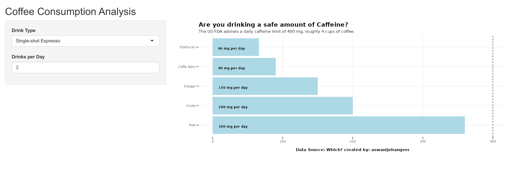
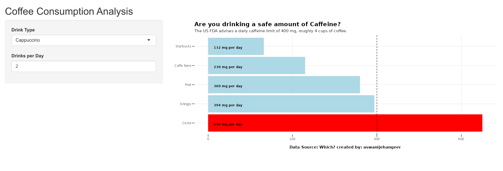

# Coffee Consumption Analysis Shiny App

This Shiny app is designed to provide insights into coffee consumption by considering caffeine content and drink types. Users can choose a specific drink type and input the number of drinks per day to visualize the total caffeine intake for each coffee chain.

[Check Live App here](https://jehangeer.shinyapps.io/Caffeine_Consumption_Analysis_Shiny_App/)

## File Structure

- **app.R**: Main R script integrating the Shiny app.
- **gobal.R**: Contains global R script.

## Screenshots

Initial interaction with the app.

Visualizing a drink type and specifying drinks per day.

## Credits

- Inspird by: [ Andy Kriebel's MakeoverMonday Visualization](https://public.tableau.com/app/profile/andy.kriebel/viz/MakeoverMonday2023Week9-Areyoudrinkingasafeamountofcaffeine/MM2023W9)
